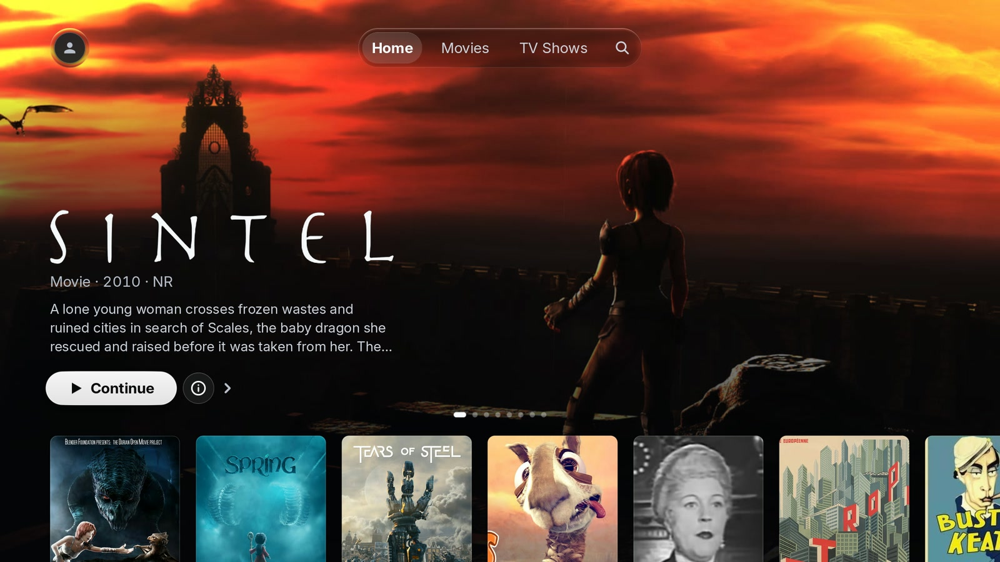
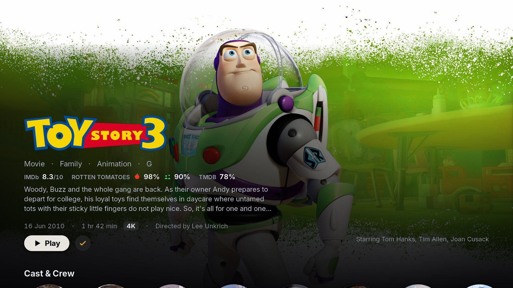
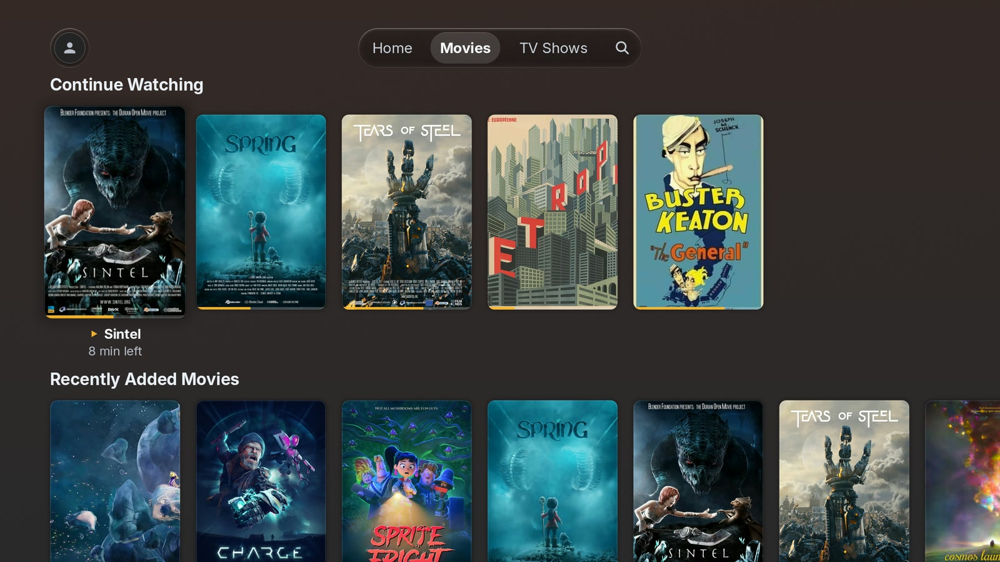
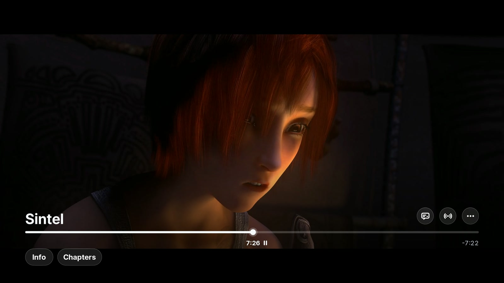

# PlxNative

An unofficial native [Plex](https://www.plex.tv/) client for LG webOS 4.x televisions.

*In daily use on a webOS 4.5 set. The
[latest release](https://github.com/GLinnik21/plx-native/releases/latest) is for webOS 4.x; the
Homebrew Channel listing is
[submitted](https://github.com/webosbrew/apps-repo/pull/224).*

## Why this exists

The official Plex app on my old LG is slow. Scrolling a shelf stutters, opening a poster takes a
beat too long. It behaves like a web page, and when I went looking, that turned out to be exactly
what it is: a web app running in the TV's Chromium.

Writing a whole client was not my first idea. I tried the obvious things first, and this project is
what was left after both failed:

- **Patching and optimising the web app.** You can get at it and change it, and I did. The ceiling
  isn't in the code, though — it's the browser itself on hardware this old.
- **Kodi with a Plex plugin.** There isn't enough free memory on this TV to run it. Most of the RAM
  is already spoken for by webOS.

What kept nagging at me was the Apple TV app: it isn't a web view, and its interface simply moves. The
answer turned out to be unglamorous — it's a native app. No browser, no JavaScript, no web view. It
just draws.

So I wrote one. PlxNative is an Apple-TV-inspired Plex client that draws its interface directly on the GPU
and hands video to the TV's own hardware decoder. Almost all of it is Rust.

I use it myself, every day, to watch things off my server in the next room.

## What it looks like

Real screenshots off the television, not mockups.



**Home** — a hero for whatever you're partway through, shelves underneath.



**Detail** — ratings, cast, and where to carry on.



**Library** — sort, filter, unwatched-only, and an A–Z rail down the side.



**Player** — the transport over hardware-decoded 4K. This one is the whole point of the project:
the picture is on the TV's video plane, decoded by the same silicon the built-in apps use, with the
interface drawn on top of it. That's the thing a browser-based client can't do.

## What it does

- Sign in on the TV with an on-screen QR code, pick a Plex Home profile, browse, and play.
- **Direct play wherever the TV can decode it** — HEVC, 4K, 10-bit — and ask the server to
  transcode only when it truly can't.
- Resume, seek and scrub, chapters, audio and subtitle track switching (including image subtitles),
  Skip Intro / Skip Credits, Up Next with auto-advance, and progress reported back to your server.

**Your library never leaves your network.** The app talks to your own Plex Media Server, to
`plex.tv` to sign in, and to `discover.provider.plex.tv` for cast biographies. No analytics, no
telemetry, no crash reporting. I didn't leave it out to be virtuous — I just never wanted any.

## Before you install

**What you need.** An LG TV on **webOS 4.x** (why it stops there is below), a Plex Media Server, a
Plex account, and a way to install unsigned apps — the
[Homebrew Channel](https://github.com/webosbrew/webos-homebrew-channel), which installs any `.ipk`
you point it at whether or not it's in the catalogue, or LG Developer Mode. You do **not** need a
rooted TV — the app runs in LG's normal sandbox like anything else on the set, unprivileged and
with no special permissions. Root only matters for the development loop below.

**The honest scope.** I built this for how *I* watch, so it's narrower than Plex's:

- **Movies and TV shows.** No music, no photos, no live TV or DVR.
- **A server on your LAN.** The app only connects to a server it finds locally, over a socket that
  takes a numeric address with no DNS and no TLS. Remote-only and relay servers won't connect at
  all, and there's nowhere to type an address in.
- **webOS 4.x.** 5.0 replaced the LG library that puts decoded video on the hardware plane. A
  replacement is written, but it does not work yet: it has now been run on webOS 6 and 10 and the
  app fails to start there. Support comes back when that is fixed and someone has watched something
  on it. [#224](https://github.com/webosbrew/apps-repo/pull/224) has the report.
- **One panel.** The app *tells* your server it can handle HEVC, 4K and 10-bit; it doesn't ask the
  television, because that's what mine does. On a lower-end webOS 4.x set that will be wrong, and
  so will the fallback.
- **One person's spare time.** There will be bugs I haven't hit because I don't watch the way you do.

If that fits, it's genuinely nice to use. If it doesn't, the official app will serve you better.

## Installing

> **Not in the Homebrew Channel's app list yet** — the submission is
> [open](https://github.com/webosbrew/apps-repo/pull/224). Until it lands, point the Channel at the
> `.ipk` below yourself, or use dev-manager-desktop.

If you install through **Developer Mode** rather than the Homebrew Channel, know that LG expires a
Dev Mode session after 1000 hours and *uninstalls your apps* when it does — dev-manager-desktop can
renew it for you before that happens. The Homebrew Channel has no expiry.

Grab the `.ipk` from the [latest release](https://github.com/GLinnik21/plx-native/releases) and
install it with the Homebrew Channel or
[dev-manager-desktop](https://github.com/webosbrew/dev-manager-desktop).

Every release will also publish a `sha256`, and it's worth checking. Nothing in this distribution chain
is code-signed, so that hash is the only thing standing between you and a tampered package. Builds
are reproducible: the same commit, toolchain and configuration give a byte-identical `.ipk`, so you
can rebuild and compare. Use `make RELEASE=1 ipk` if you do — a plain `make ipk` is a development
build and differs on purpose, so its hash won't match and that isn't tampering.

## Building it yourself

Cross-compiled to 32-bit ARM from macOS or **arm64** Linux. (There is no x86_64 build of the
webOS NDK, so an x86_64 Linux host can't build this at all — that's also why CI runs on arm64.)
From a clean clone:

```sh
make setup-env        # one-time: fetches the webOS NDK into ~/webos-ndk (~140 MB down, ~700 MB on disk)
rustup toolchain install nightly --component rust-src --component clippy   # build-std + the lint gate
make                  # builds pkg/plxnative
make ipk              # builds the installable pkg/com.beb.plxnative_<version>_arm.ipk
```

`make check` runs the lint gate and the host unit suite — seconds once warm, and no TV involved.
Run it first; it's the only signal you get without waking a television.

### Developing against a real TV

The rest of the loop assumes a **rooted** TV reachable over ssh, because it deploys by copying the
binary straight into the installed app directory:

```sh
make TV=<ip> deploy   # scp the binary + assets
make TV=<ip> run      # launch, hold it up, then print the on-device event log
make TV=<ip> test     # deploy + run
./tests/run.py        # the on-device regression suite
./tests/run.py --fps  # the frame-rate regression scenes
```

The device is the real test. Nothing on your computer draws a pixel, decodes a frame, or talks to
the TV's media stack, so a green host suite proves much less than it looks like it does.
`./tests/run.py` needs two gitignored files: `tests/manifest.local.json`, mapping named media shapes
to items in *your* library (copy the `.example` beside it and drop the ones you don't have), and
`src/config.local.h` with your Plex token, which the harness reads on the host and injects — it is
never compiled into the binary.

For anything you intend to ship, add `RELEASE=1` to **every** command that builds or packages
(`make RELEASE=1 ipk`). It drops the developer feature set: the on-screen frame counter, and the
whole `/tmp` trigger surface the test harness drives the app through.

## Layout

| Path | What |
|---|---|
| `rust-modules/src/` | the application — UI, event loop, input, playback, the Plex data layer |
| `rust-modules/src/ui/` | the UI as a design system: theme tokens, components, screens |
| `rust-modules/src/player/` | the buffer-feed video engine and its worker threads |
| `src/` | the only C: a boot shim, the LG media-API seam, and the SVG rasterizer |
| `docs/` | verified PMS API reference, design notes, and the distribution analysis |
| `tests/` | the on-device regression suite |
| `ci/`, `.github/` | packaging, ELF/package assertions, release automation |

`CLAUDE.md` is the orientation document — architecture, the build, and all the non-obvious things
that took a while to work out. Each major subsystem has one of its own next to the code.

## Contributing

Issues and pull requests are welcome, especially from anyone whose TV or library differs from mine.

**A rooted webOS 5+ set is the thing I need most.** I can't develop for one blind: no emulator
substitutes for the hardware
([why](docs/distribution.md#34a-no-emulator-substitutes-for-the-hardware-researched-2026-07-28)),
and what's missing is someone who can run and debug on the set — not a report of what's installed
on it, which is already known. A different 4.x panel, a remote server, or media this has never met
are all useful too.

Two things worth knowing first:

- **Run `make check` before you push**, on nightly — `make check` runs `cargo +nightly`, while a bare
  `cargo test` picks up your default toolchain. The two have disagreed.
- **Anything touching playback, the UI or input has to be checked on a real TV.** Nothing on your
  computer draws a pixel or decodes a frame, so a green host suite proves less than it looks like
  it does. Say in the PR what you verified and how.

## Licence

[MIT](LICENSE), © 2026 Gleb Linnik.

The PlxNative name and its brand artwork — logo, splash and launcher icons — are excluded; see [`TRADEMARKS.md`](TRADEMARKS.md),
which also carries the Plex and LG non-affiliation statements.

Third-party components and their licences are in
[`THIRD-PARTY-NOTICES.md`](THIRD-PARTY-NOTICES.md) and `licenses/`. Notably the app links the TV's
own FFmpeg and GLib **dynamically** rather than bundling them. All of it — the notices, the licence
texts, `LICENSE` and `TRADEMARKS.md` — ships inside the `.ipk`, so it travels with the binary and
not only with this repository.

This is an unofficial client. It is not affiliated with, endorsed by, or sponsored by Plex GmbH or
LG Electronics. "Plex", "Rotten Tomatoes", "IMDb", "TMDB", "LG" and "webOS" are trademarks of their
respective owners; where they appear in the app, they identify whose service or score is being shown.
