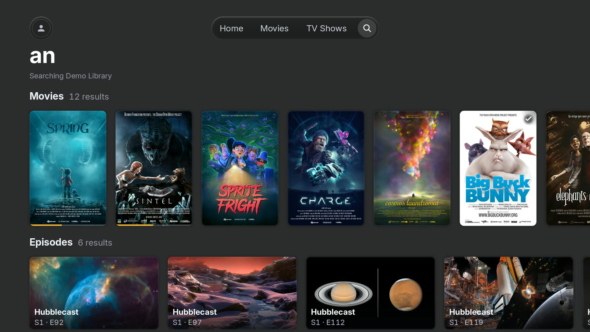

# PlxNative

A fast, unofficial [Plex](https://www.plex.tv/) client for LG webOS televisions. Native, not a web
page — the interface is drawn straight on the GPU at 60 fps, and video plays on the TV's own decoder.

*In daily use on a 2019 LG set. Get started with the
[installation guide](docs/install-and-verify.md).*

## Why this exists

The official Plex app on my old LG is slow. Scrolling a shelf stutters, opening a poster takes a
beat too long. It behaves like a web page because it is one: a web app running in the television's
Chromium. Patching it doesn't help — the ceiling isn't the code, it's the browser.

So I threw the browser away.

PlxNative draws straight on the GPU and hands video to the same silicon the built-in apps use. No
Chromium, no JavaScript, no web view. It just draws. Almost all of it is Rust, and I use it every
day to watch things off my server in the next room.

## What it looks like

Real screenshots off the television, not mockups.

**Home** — a rotating hero from what you're partway through and what's just landed, shelves under it.

**Library** — sort, filter (including unwatched-only), and an A–Z rail down the side.

**Search** — one query across every server you can reach, results grouped by kind.

**Player** — the transport with chapters and track menus, drawn on top of video the
television is decoding itself.

## What it does

- **An interface that keeps up with the remote.** 60 fps on the 2019 set I develop on, with
  frame-rate regression scenes that measure it on the television rather than trusting it.
- **Sign in on the TV** with an on-screen QR code and pick a Plex Home profile.
- **Browse and search your libraries** — on your own servers and on ones shared with you. Your
  servers' libraries, that is, not Plex's catalogue or Watchlist.
- **Direct play** H.264 and HEVC — 4K, 10-bit, Dolby Vision profiles 5 and 8, E-AC-3 Atmos —
  decided against your television's own codec table where it publishes one. Anything else the
  server transcodes, and you can switch a playback to Auto to follow a link whose speed changes.
- **Everything you expect while watching**: resume, seek and scrub, chapters, audio and subtitle
  tracks (including image subtitles), Skip Intro, Skip Credits, Up Next with auto-advance, and
  progress reported back to your server.

## Will it work on my television?

Video has been watched on two sets in the world, so this is deliberately specific about which:

| Your set | What's known |
|---|---|
| **webOS 4.5** — LG 49SM9000PLA | Plays video. My own television; tested before every release. |
| **webOS 6.5.2** — one LG 65UP7560AUD | Plays video, [reported by someone else](https://github.com/GLinnik21/plx-native/issues/22) — six of eight attempts. |
| **webOS 10.3.1** — one rented set | The pipeline accepted HEVC direct play, though nobody watched the picture. Every server transcode is refused, so a file this app can't direct-play won't play at all. |
| **Anything else from webOS 4.0 up** | Starts — the binary resolves cleanly against nine real firmware images. Nothing further is known. |
| **webOS 3.9 and older** | Won't start — you'd get a tile that does nothing. |

If your set is in the middle, [tell me what happened](https://github.com/GLinnik21/plx-native/issues)
— it working is as useful a report as it failing.

## Installing

**First time installing an app outside the LG Content Store?** Follow the
[**step-by-step installation guide**](docs/install-and-verify.md). It starts with a regular LG
webOS TV, a computer on the same network, and a Plex account with access to your own or a shared
server. **No root is required.**

Set up LG Developer Mode and connect with webOS Dev Manager, then choose:

- **Install PlxNative directly:** add only PlxNative to the TV; install future `.ipk` updates from
  your computer.
- **Install Homebrew Channel first:** get an app catalogue on the TV, then install PlxNative and
  its updates with the remote.

**Already have Homebrew Channel?** Find [PlxNative in its catalogue](https://repo.webosbrew.org/apps/com.beb.plxnative/)
and select **Install**. Skip the computer setup.

**Developer Mode needs periodic renewal.** If it expires and LG disables Developer Mode, apps
installed through it are removed. Installing Homebrew Channel through Developer Mode does not
remove that requirement. The guide explains [how to renew the session](docs/install-and-verify.md#important-developer-mode-expires).

For manual `.ipk` downloads, [verify the release checksum](docs/install-and-verify.md#verifying-the-package)
before installing. Homebrew Channel verifies catalogue downloads for you.

## Privacy

**Your library data never reaches me.** The app talks to your Plex server, to `plex.tv` to sign in,
and to `discover.provider.plex.tv` for cast biographies.

**Crash reports and usage analytics are off until you turn them on** — two separate first-run
questions, each answerable with Don't Share, both reversible later under Account → Settings →
Privacy & data. No title, search term, subtitle line, server name or address can appear in any
report. [`PRIVACY.md`](PRIVACY.md) is the whole statement, including the schemas.

## The honest scope

I built this for how *I* watch, so it's narrower than Plex's:

- **Movies and TV shows.** No music, no photos, no live TV or DVR.
- **No typing in server addresses.** Servers come from your Plex account; set them up on a phone or
  PC and choose from what's there. Servers reached through Plex's relay, or that require an
  encrypted connection, are supported but haven't been watched end to end.
- **One person's spare time.** There will be bugs I haven't hit, because I don't watch the way you do.

If that fits, it's genuinely nice to use. If it doesn't, the official app will serve you better.

## Contributing

Issues and pull requests are welcome, especially from anyone whose television or library differs
from mine — [**docs/building.md**](docs/building.md) is the build and the test loop, and says what
hardware I most need help with. Security issues go through [`SECURITY.md`](SECURITY.md) rather than
a public issue.

## Acknowledgements

Error monitoring for PlxNative is sponsored by [Sentry](https://sentry.io/for/good/).

<a href="https://sentry.io/for/good/">
  <picture>
    <source media="(prefers-color-scheme: dark)" srcset="docs/assets/sentry-wordmark-light.svg">
    <source media="(prefers-color-scheme: light)" srcset="docs/assets/sentry-wordmark-dark.svg">
    
  </picture>
</a>

## Licence

[GPL-3.0-or-later](LICENSE), © 2026 Gleb Linnik. The PlxNative name and its brand artwork are excluded — see
[`TRADEMARKS.md`](TRADEMARKS.md), which also carries the Plex and LG non-affiliation statements.
Third-party components and their licences are in
[`THIRD-PARTY-NOTICES.md`](THIRD-PARTY-NOTICES.md) and `licenses/` — notably the app ships its own
LGPL build of FFmpeg. Those notices and licence texts ship inside the `.ipk` too, so they travel
with the binary and not only with this repository.

This is an unofficial client, not affiliated with, endorsed by, or sponsored by Plex GmbH or LG
Electronics. "Plex", "Rotten Tomatoes", "IMDb", "TMDB", "LG" and "webOS" are trademarks of their
respective owners; where they appear in the app, they identify whose service or score is being shown.
