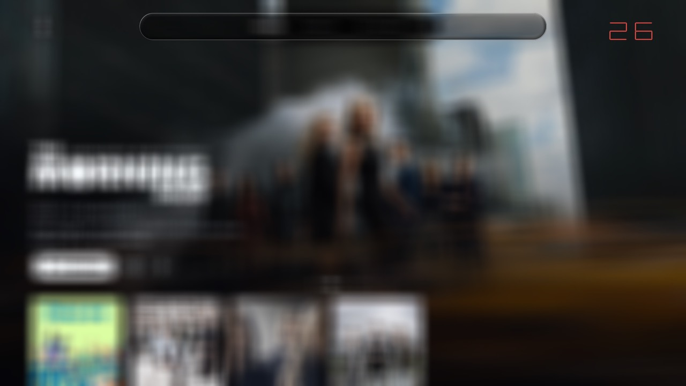

# The frame budget — what this television will actually give you

**Who this is for:** whoever is designing screens for this app. It is written so you can decide,
without asking an engineer, whether an idea fits. Everything in it was measured on the real set
(LG 49SM9000PLA, webOS 4.5, Mali-T820 MP2) on 2026-08-19, in one session, with the legs interleaved.

The engineering companion is `docs/backdrop-blur-profiling.md`, which prices things in GPU cycles.
This note prices them in **frames and milliseconds**, which is the currency you spend.

---

## 1. The one-page answer

**You have 16.7 milliseconds per frame at 60 fps. The Home page with its grid moving already
spends 8.9 of them. About 7.8 ms are left, and that is the whole budget.**

**Ordinary drawing is charged by the screen area it covers**, at a price per pixel set by what kind
of thing it is. These add up, so you can plan with them:

| what you draw | price per screen pixel | 7.8 ms buys you |
|---|---|---|
| a flat photograph (the hero image) | **~4 ns** | most of the screen |
| a poster card (art + rim + shadow) | **~15 ns** | ~4 poster tiles, or ¼ of the screen |

**Backdrop glass is charged differently, and this is the single thing to take away.** Its visible
slab is about 16 ns/px, dearer than anything else the app draws — but that is the small half of the
bill. The large half is the blur *behind* it, and what that costs is set by **the rectangle the
renderer has to blur**, in whole 16.7 ms steps.

Four consequences you can act on immediately:

* **What glass is charged for is the RECTANGLE THAT HAS TO BE BLURRED — your surface grown by 88
  pixels on every side, and unioned across every glass surface in the frame.** Not the surface. Keep
  that rectangle **under about 300,000 pixels and you stay at 60 fps**; past it you drop to 45, and
  it steps down from there. **The shipped Account panel sits just inside that line and is free**
  (measured, §3.4).
* **Glass steps your frame rate rather than sliding it: 60 → 45 → 36 → 30.** The blur refreshes on
  one frame in three, and that frame either fits in one 16.7 ms slot or takes two, or three. You are
  buying whole slots, so there is no partial credit — see §3.2, where the model reproduces every
  glass measurement in this document exactly.
* **A full-screen glass blur costs 60 → 24 fps.** 32.8 ms of work against a 7.8 ms budget — four
  times over — and no refresh setting changes it: refreshed every third frame or captured once and
  frozen, it measured 24 fps either way (§5).
* **How MANY glass surfaces you draw is free. WHERE you put them is not.** One, two or four surfaces
  inside the same footprint all measured 45 fps. But two identical surfaces moved to opposite corners
  — the same glass, the same pixels — went 45 → 36, because the one shared blur then has to cover
  the whole screen and everything between them. **Keep glass together.**

**Nothing broke.** Pushed to four large panels with a full-screen blur refreshed every frame, the
set ran at 19 fps and kept running: no crash, no stutter cliff, no thermal collapse. There is no
edge to fall off — there is a **slope, and it starts at the first glass surface you add**.

---

## 2. How to read the numbers

`fps` is frames actually put on the panel, from the app's once-per-second heartbeat. The panel is
60 Hz, so **60 fps means "it fits" and tells you nothing about how much room is left**; that is why
§3's table also gives milliseconds.

Milliseconds are `1000 / fps` — the true average time one frame took. **A "cost" throughout this
document is the work a thing adds to the frame: its frame time minus the 8.9 ms base.** So a cost
under 7.8 ms fits inside 60 fps and a cost above it does not, which is why every 60 fps row reads
"fits (≤7.8 ms)" rather than "free". The base frame (8.9 ms) is not measured directly; it is the
intercept of the poster-card ramp in §3.3, whose straight line fits its four loaded points to within
0.5 ms and then predicts the fifth — the last card count that still holds 60 fps — to within 0.1 ms.
Treat it as good to about ±1 ms.

**Everything here was measured on Home with the grid scrolling continuously and the app's
repaint-skipping turned off**, i.e. the worst honest case for a browsing screen. A settled screen
that has stopped repainting costs nothing at all.

---

## 3. The budget

### 3.1 Backdrop glass

**Index everything on the blurred REGION, not on the surface.** The renderer has to snapshot and
blur your surface grown by **88 pixels on every side** — the glass rim bends in pixels from outside
itself — and where a frame holds several glass surfaces it blurs **one rectangle containing all of
them**. That rectangle is what you are charged for. You do not set it directly; you set it by how
big your surfaces are and how far apart you put them.

`every 3rd frame` is the cadence the app ships. `never` means captured once and reused — a static
backdrop under a still page.

| glass in the frame | surface px | **blurred region** | refresh | fps | cost |
|---|---|---|---|---|---|
| — none — | 0 | — | — | **60** | — |
| 300 x 200 panel | 60,000 | 179,000 | every 3rd | **60** | fits (≤7.8 ms) |
| 295 x 295 panel | 87,000 | 222,000 | every 3rd | **60** | fits |
| one 300 x 300 panel | 90,000 | 230,000 | every 3rd | **60** | fits |
| **the shipped Account popover** (440 x 220) | 97,000 | **241,000** | every 3rd | **60** | **fits** |
| 450 x 300 panel | 135,000 | 298,000 | every 3rd | **60** | fits, only just |
| 1148 x 76 (the tab bar) | 87,000 | 334,000 | every 3rd | **45** | +13.4 ms |
| two 300 x 300 panels, adjacent | 180,000 | 384,000 | every 3rd | **45** | +13.4 ms |
| 608 x 396 panel | 241,000 | 452,000 | every 3rd | **45** | +13.4 ms |
| 960 x 540 panel | 518,000 | 813,000 | every 3rd | **36** | +18.9 ms |
| 1324 x 456 panel | 604,000 | 948,000 | every 3rd | **36** | +18.9 ms |
| **two 300 x 300 panels, opposite corners** | 180,000 | **2,074,000** | every 3rd | **36** | +18.9 ms |
| 1920 x 1080 panel | 2,074,000 | 2,074,000 | every 3rd | **24** | +32.8 ms |
| 1920 x 1080 panel | 2,074,000 | 2,074,000 | every frame | **19** | +43.8 ms |

Every region figure above is the one the renderer *logged for that leg*, not one computed from the
layout — the dial prints `blur_config` on every run, and the numbers here are read off it.

**The 60 fps line is at about 300,000 region pixels.** 298,000 held 60 (marginally — its worst
second was 56); 334,000 did not. Everything design can put on this screen sits on one side of that
number or the other.

**Count is free; distance is not.** One 608x396 panel, two 292x396 and four 140x396 — same
footprint, same region — all measured **45 fps exactly**. But the two-surface rows above are the
sharper lesson: two *identical* 300x300 panels cost **45 fps adjacent and 36 fps in opposite
corners**. Same glass, same 180,000 pixels of it, and the region went from 384,000 to the entire
panel because the one shared snapshot had to span them. **A row of glass controls is cheap. A glass
control at the top and another at the bottom is a full-screen blur.**

**Small is not automatically cheap.** The tab bar covers only 87,000 pixels — a third of the 608x396
panel — and costs the same, because a 1148-pixel-wide bar grown by 88 a side is a 334,000-pixel
region. §8 shows the surface's *shape* costs nothing on its own; it is the margin that gets you.

### 3.2 The blur's refresh rate is a weak and badly-behaved lever

One surface, one region, only the cadence moving (a 608x396 panel, region 452,000 px):

| refresh | fps | cost |
|---|---|---|
| never (captured once, then reused) | **60** | fits (≤7.8 ms) |
| every 6th frame | **52** | 10.4 ms |
| every 3rd frame (what ships) | **45** | 13.4 ms |
| every 2nd frame | **40** | 16.1 ms |
| every frame | **47** | 12.4 ms |

* **Not refreshing at all is nearly free.** A glass surface over a page that is not moving costs
  only its own composite, and at 608x396 that fits inside the budget. So does the tab bar (§8).
* **The first refresh is most of the price.** Not refreshing costs under 7.8 ms; refreshing every
  sixth frame costs 10.4; every third 13.4; every second 16.1; every frame 12.4. Almost the whole
  bill arrives with the first refresh you allow, and the rate barely moves it after that.
* **It is not monotone.** Every-second-frame is the *worst* setting measured, worse than refreshing
  every single frame.

**Why, and it is the most useful mental model in this document.** The panel hands out a slot every
16.7 ms. A frame either fits in one slot or takes two, or three. Your frame rate is 60 divided by the
average number of slots a frame needs — and **a slot is charged whole**, so a refresh that overruns
by a little costs the same as one that overruns by a lot.

At the shipped every-third-frame cadence that gives an exact law: two light frames of one slot each
plus one refresh frame of **N** slots, so `fps = 60 x 3 / (2 + N)`. **Every glass measurement in this
document lands on an integer N**, with no exceptions and nothing in between:

| blurred region | slots the refresh frame needs | fps |
|---|---|---|
| up to ~300,000 px | 1 | **60** |
| ~330,000 – 450,000 px | 2 | **45** |
| ~800,000 – 2,074,000 px | 3 | **36** |
| (extrapolating) | 4 | **30** |

Thirteen measured glass configurations, four distinct region sizes, and the slot count came out as
exactly 3.00, 4.00 and 5.00 slots per three frames. That is why glass **steps** your frame rate
instead of sliding it, and it is the practical form of the budget: you are not buying milliseconds
of blur, you are buying whether the refresh frame fits in one slot.

(The model accounts for the shape of the cadence table above but not for the every-second-frame
inversion, which reproduced in two runs and stays unexplained — see §10. It is another reason not to
plan around a particular cadence.)

So: **do not design around "we'll refresh it slowly to save money."** Spreading the same work over
fewer, heavier frames does not help, because the overrun is rounded up every time it happens. Decide
instead whether the backdrop needs to be live at all — *that* is worth 10 ms.

### 3.3 Poster cards and photographs

| what | area drawn | fps | frame | cost |
|---|---|---|---|---|
| 4 poster tiles (300x450) | 540,000 | **60** | 16.7 ms | 7.9 ms — the last one that fits |
| 5 poster tiles | 675,000 | **53** | 18.9 ms | 10.0 ms |
| 6 poster tiles | 810,000 | **48** | 20.8 ms | 12.0 ms |
| 7 poster tiles | 945,000 | **45** | 22.2 ms | 13.4 ms |
| 8 poster tiles | 1,080,000 | **40** | 25.0 ms | 16.1 ms |
| 12 poster tiles | 1,620,000 | **35** | 28.6 ms | 19.7 ms |
| 12 poster tiles, all focused | 1,620,000 | **34** | 29.4 ms | 20.5 ms |
| one full-screen card | 2,074,000 | **35** | 28.6 ms | 19.7 ms |
| one full-screen flat photograph | 2,074,000 | **57** | 17.5 ms | 8.7 ms |

**Cards are linear in area and the line is clean**: `frame = 8.87 ms + 14.7 ns x (card pixels)`,
which fits every loaded point above to within 0.5 ms and correctly predicts, to within 0.1 ms, that
four tiles is the last count that still holds 60. So:

* **Each poster tile of 300x450 costs about 2 ms.** You can have four before the frame slips.
* **Focus does not change the price.** Twelve focused tiles cost 0.8 ms more than twelve resting
  ones — the focus glow and the grown shadow are within measurement noise of free.
* **A photograph is less than half the price of the same area in cards** — a full-screen one costs
  8.7 ms against a full-screen card's 19.7. Big art is not what costs; *card treatment* is.
* **A poster wall the size of the panel costs about 20 ms** and lands the app at 35 fps.

**How many cards can this hardware carry, and what happens at the limit?** Directly: **four
poster tiles is the last count that holds 60 fps**, and every tile after that costs about 2 ms, so
five is 53, six is 48, seven is 45, eight is 40 and twelve is 35. The relationship is a straight
line with no knee in it — the panel's whole area in cards is 2 million pixels, which lands at 35 fps
and 96% arithmetic-pipe occupancy. **Nothing "happens" at the limit**: there is no stall, no dropped
input, no thermal event, no visible tearing. The frame rate just keeps falling in proportion to the
area you cover. The prediction that filling the panel with cards "would roughly double the app's
arithmetic and be the first thing capable of missing vsync" turns out to be right about the
arithmetic — a full panel of cards adds **12.7 million instruction words** to a frame that already
issues 15.5 million, so +82%, close to a doubling — and right that it is the first thing design
controls that can miss vsync. What it gets wrong is the shape of the failure: not a cliff, a slope.

### 3.4 The reconciliation — and a correction to an earlier draft of this note

Two other agents measured the **shipped Account glass panel** at **60 fps** against a glass-absent
control. An earlier draft of this document had a row reading "608x396 glass, 45 fps", labelled *"the
Account panel's size"*. Both were careful, both had their profilers disarmed, and 45 against 60 on
one nominal configuration is a factor that would change every row here.

**They were measuring different surfaces, and the mislabelling was mine.** `608x396` is the Account
popover's **blurred region**; the popover itself is **440 x 220**. The old row drew a *panel* of
608x396 — two and a half times the area, and a region of 784x576, nearly twice as large.

Settled in one launch, one scene, all legs interleaved, both profilers disarmed:

| leg | route | logged region | measured refreshes/s | fps |
|---|---|---|---|---|
| control, no glass | home | — | 0 | **60** |
| **the real shipped Account popover** | account | **608 x 396** | 18 | **60** |
| a dial panel at the popover's own geometry (440x220) | home | 616 x 400 | 20 | **60** |
| the old "608x396" row | home | 784 x 576 | 15 | **45** |

Three things this establishes, beyond the correction itself:

* **The shipped Account glass is free** — 60 fps, in my own instrument, interleaved with the control
  in the same launch. The other agents' number is the one that generalises.
* **The instrument is not the problem.** A synthetic panel at the shipped panel's geometry measures
  the same 60 fps as the shipped panel. The dial does nothing the real path does not, so the area
  law holds and its constant is right — it just has to be indexed on the region.
* **The cadence was verified, not assumed.** Every leg now reports the blur refreshes it actually
  took: 20/s where 60 frames present at every-third (60/3), 15/s where 45 present (45/3), and 18/s
  for the shipped panel, whose policy additionally skips refreshes when the page underneath has not
  changed. No leg silently refreshed at a rate other than the one it claimed.

**And one more correction to the record, on the same theme.** The archive carries a pair of GPU-cycle
figures — a first glass panel costing **+11.4%** of frame cycles and a second, larger one only
**+3.4%** — which has been read as *"the first surface pays for the machinery and extra ones are
nearly free"*. **Do not use that pair to reason about frames.** Two things are wrong with the
reading. First, the geometry: those two legs were the Account popover (region 241,000 px) and then
the Account popover **plus the tab bar**, whose union is 1324x456 = **604,000 px**. The second
surface did not slot into the first one's rectangle — it is at the top of the screen while the panel
is in the middle, so the union grew by 363,000 px, slightly *more* than the tab bar's own region
would have been alone. In frames, §3.1's curve puts a 604,000-px region at 45 fps or below, so that
"nearly free" second surface is in fact the expensive one. Second, those cycle figures come from
profiled runs, and §7 shows what a profiler does to this measurement: it drops the control leg from
60 fps to 45 and compresses the legs together. **Cycles are for saying where work sits; frames are
for saying what it costs.** The frames version of the rule is §3.1's: extra surfaces are free when
they fit inside the rectangle you were already blurring, and expensive when they enlarge it.

**A logging trap worth recording**, because it nearly became a second theory: the profiler's
`blur_config` line prints `quarter=480x270` on **every** capture-path leg regardless of surface size,
which reads as "the capture path blurs the whole screen no matter what". It does not. `480x270` is
the *allocation* of the blur chain's small targets, which are made full-screen-sized once at boot and
never resized; the blurred area is the `aligned=` field on the same line, and it tracked the region
exactly in all thirteen legs. Read `aligned=`, never `quarter=`.

### 3.5 Everything on one scale

Per screen pixel covered, on this hardware, measured:

For everything that is **just drawn** — art, photographs, fills — the price is per pixel covered and
you can add it up:

```
flat photograph          4 ns/px    ▏
poster card (large)     10 ns/px    ▍
poster card (300x450)   15 ns/px    ▋      <- the penumbra ring costs more on small tiles
glass composite         16 ns/px    ▋      <- the visible slab, WITHOUT its blur
```

You have **7.8 ms**. Multiply and see if it fits.

**Glass does not work that way and must not be added up like this.** Its composite is only the small
half of the bill; the large half is the blur behind it, which is charged in whole 16.7 ms slots
according to how big the shared blurred rectangle is (§3.1, §3.2). The planning rule for glass is a
single number:

> **Keep the union of every glass surface in the frame, grown by 88 pixels a side, under about
> 300,000 pixels. Inside that you keep 60 fps. Outside it you get 45, then 36.**

---

## 4. Things the hardware simply will not do

These are not budget items. They are unavailable at any frame rate.

1. **Two pages cannot be on screen at once.** Every screen's draw begins by clearing the frame, and
   the app holds no picture of the page it is leaving. A route transition can dissolve *through*
   something (grey today, blur if you want — §5), but it can never cross-dissolve page A into page
   B. Designing a transition that shows both is designing something that cannot be built without
   rebuilding the renderer.
2. **There is exactly one blur cache.** Every glass surface in a frame samples the *same* blurred
   snapshot, taken once, of one rectangle that is the union of what all of them asked for. Two
   glass surfaces far apart therefore drag that rectangle out toward the whole screen and get
   charged for the space between them. **Measured:** two identical 300x300 panels cost **45 fps
   side by side and 36 fps in opposite corners** — the same glass, and a blurred region that grew
   from 384,000 pixels to all 2,074,000 of them. Adjacent glass is nearly free; scattered glass is a
   full-screen blur wearing a disguise.
3. **Glass on top of glass shows nothing new.** Because of (2), a glass surface sitting over an
   area that is already blurred samples the identical pixels: you get its tint, its rim and its
   edge refraction, but no additional blur. Giving the upper surface its own backdrop needs a
   second cache, which was built and measured: **60 → 16 fps** (§5). It is not affordable.
4. **The blur cannot see video.** Over the player, the app's own frame is transparent where the
   hardware video plane shows through, so a backdrop blur there would smear transparency, not
   picture. Glass is unavailable on the player's panels, permanently.
5. **No new render targets per frame, and no GLES3.** The renderer allocates its buffers once at
   boot; anything that would need a fresh full-screen buffer while running is out. The GPU is
   OpenGL ES 2 only — no compute, no multiple render targets, no fancy filtering.
6. **A settled screen stops repainting.** This is why the app idles at ~2% of a CPU core. Anything
   that animates forever — a shimmer, a drifting gradient, a breathing glow — turns that off and
   costs the whole frame, continuously, for as long as it is on screen.

---

## 5. The blurred route transition, answered

**The idea:** today a route change (Home → a library) dips the outgoing page to the app's grey
background, flips at the bottom, and fades the new page up. Could that grey trough be a **blur** of
the outgoing page instead, with the tab bar's glass sitting on top of it?

**It was built and measured.** `/tmp/plxnative-navblur` holds the page at full brightness and
cross-fades a full-bleed blur slab over it, with a tab-track-shaped glass capsule composited above.

**The answer is yes, at a real and quantified cost.**

| | fps | frame |
|---|---|---|
| the composition held at full strength | **27** | 37.0 ms |
| the same, with a private second blur cache for the capsule | **16** | 62.5 ms |
| a real route bounce every 1.4 s (the transition is ~210 ms of it) | **49–60**, mean 52 | — |

* **During the transition the app runs at 27 fps.** A 210 ms transition therefore plays in about
  **6 frames instead of 13**. Whether that reads as a soft blur bloom or as a stutter is a
  judgement to make on the panel, not from this table — but it is half frame rate, and you should
  expect to *see* it in the ramp.
* **Averaged over normal navigation it costs about 8 fps** — bouncing between two routes every
  1.4 s, the once-a-second frame rate ran 49–56 with a mean of 52, against a flat 60 with nothing
  happening. Navigation is not continuous in real use, so this is a transient, not a standing cost.
* **The tab bar's glass must ride the same cache.** Mode 2, which gives the capsule its own
  backdrop, costs 60 → 16 fps. Do not design around it.
* **What that means visually:** with one cache the capsule over the blur reads as a *tinted, rimmed
  capsule*, not as a second layer of glass, because everything under it is already blurred to the
  same degree. The capture below, taken off the television's own panel output, shows this working:
  the rim light, the lens bending at the capsule's edge and the darker scrim all read clearly, and
  the composition looks deliberate. It just is not "glass over blur" in the sense of two different
  amounts of blur — that is unavailable.



*The prototype on the television: the whole page blurred, with the tab-track capsule composited over
it. The capsule's rim light, its edge refraction and its darker scrim are all doing their job; what
it has no room to do is blur, because what is under it is already blurred.*

**If you want it, here is how to make it cheaper**, in the order of how much it buys:

1. **Blur less than the whole screen — this is the only large lever.** Cost is close to linear in
   area, and the measured points are: a quarter of the panel (960x540) costs 13.9 ms and runs at
   **44 fps**; the whole panel costs 32.8 ms and runs at 24–27. Half the panel interpolates to about
   20 ms and **34 fps**. Note what that means: a "content band" spanning the full width with only the
   top chrome left sharp is still about two thirds of the panel, so it buys you almost nothing —
   the saving has to come from blurring a *region*, not a *band*.
2. **Shorten it.** The cost is per frame, so a 140 ms transition pays it for four frames instead of
   six. Given the frame rate during it, a shorter, more decisive move is also the safer look.
3. **Keep the frost sheet off the slab.** The prototype already does; it is worth roughly 4–5 ms at
   full screen. A transition slab is not a popover and does not need a frosted sheet over it.
4. **Freezing the blur during the fade saves nothing at full screen** — and this is worth saying,
   because it is the obvious economy and it does not work here. Captured-once and
   refreshed-every-third-frame both measured 24 fps at full screen: once the surface is that big the
   per-frame composite is the whole bill and the refresh disappears into it. Freezing *does* pay at
   panel sizes (worth ~5 ms at 960x540 and ~5.5 ms at 608x396), so it is a lever for a partial-screen
   transition, not for a full-bleed one.

None of these change the fact that a full-screen blur is over budget while it is up. **The honest
recommendation: yes, if you accept ~27 fps for the length of it.** There is no arrangement of
cadence, caching or frost that makes a full-bleed blur cheap; only shrinking it does, and shrinking
it enough to matter (down to a quarter of the panel, 44 fps) stops it being the effect you asked
for. So the real choice is between a **short full-bleed blur at 27 fps** and **no blur**. Six frames
of a low-frequency image ramping is not obviously a bad six frames — a blur is exactly the kind of
picture that hides temporal steps — but that is a judgement to make in front of the set, not in this
table.

---

## 6. Where the cliff is, and what is actually binding

**There is no cliff.** Load was escalated from nothing to four large glass panels over a
full-screen blur refreshed every single frame. The frame rate fell continuously — 60, 45, 36, 24,
19 — and nothing else changed: no crash, no freeze, no thermal event, no discontinuity anywhere on
the curve. The set simply runs slower.

The only edge that matters is the **60 fps boundary**, and it sits at about **7.8 ms of extra
work** — roughly a quarter of the screen in poster cards. For glass the same boundary is better
stated in its own terms: **a blurred region of about 300,000 pixels**, which is a panel of roughly
450x300 or anything smaller, kept together with any other glass in the frame.

**What binds is shader arithmetic — not memory, not the CPU, not the display.** Four independent
measurements say so:

* Frame time tracks the GPU's **arithmetic instruction count**, exactly: every leg's extra GPU
  cycles equal its extra arithmetic words divided by two (there are two shader cores, each retiring
  one word per cycle). The relationship holds within 10% across a 5x range of load.
* The arithmetic pipe is already **89.6% occupied on a plain Home frame**, and glass pushes it to
  **92.8%** (a quarter-screen panel) and **95.8%** (full screen). There is almost nothing left.
* **External memory traffic does not rise with glass at all** — a full-screen glass panel *reduces*
  external reads slightly while adding 157% to GPU cycles. Bandwidth is not the wall.
* When the frame overruns, the time is spent **inside the app's own drawing calls** (the driver
  blocking on a busy GPU), not waiting at the display hand-off, which stays at 0.2–0.4 ms
  throughout. The CPU-side work — input, data, layout — never appears.

Per-pixel arithmetic, measured directly:

| | arithmetic words per pixel | GPU cycles per pixel |
|---|---|---|
| a gradient or scrim | ~0.004 | 0.025 |
| flat photograph | 1.94 | 1.12 |
| poster card | 6.12 | 3.35 |
| **backdrop glass** (its composite plus its frost sheet) | **14.77** | **7.41** |

(The card and photograph figures were arrived at independently, by a different person on a different
scene with a different instrument, as 5.86 and 1.99 words per pixel. Two methods agreeing to 5% is
why these are worth quoting. The gradient row is that other measurement's.)

**The design reading:** the price of an effect on this television is the number of *maths
operations per pixel* its shader performs, multiplied by the pixels it covers. Blur-and-refract is
the most arithmetic-heavy thing in the app. Gradients, scrims and flat fills are, by comparison,
free — the app's existing washes and ramps cost 0.025 cycles per pixel, three orders of magnitude
below glass. **If an effect can be expressed as a gradient, it is free. If it has to sample its
background and bend it, it is not.**

---

## 7. Was the 50 fps thermal? No — and the earlier reading was an instrument artefact

The record carried a worrying claim: the same scene had been seen at 60 fps early in a session and
50 fps late in it, with no workload change, which would mean the frame budget design gets to spend
is set by the enclosure rather than by the renderer.

**That is not what this set does.**

* The control leg — Home with the grid scrolling, repaint-skipping off — measured **60 fps, with a
  minimum of 60 and a maximum of 60**, in every run, across a session in which the set had already
  been up **1 h 42 m** when the first measurement ran and **2 h 15 m** when the last one did, under
  continuous load from five agents throughout.
* Within each 2-minute run the drift (last third minus first third) was **0.00 to 0.50 fps** on
  every configuration, loaded and unloaded alike. Nothing decays.
* The same configurations reproduce across runs taken 40 minutes apart: 608x396 glass at the
  shipped cadence measured 45 fps in five separate legs, and the control read 60 in six.

**Where the 50 came from.** Turning on the GPU counter profiler drops the *control* leg from 60 fps
to 45 and compresses every leg toward the middle — it inserts a full pipeline drain at each frame
boundary, which costs a cheap frame ~5 ms and an expensive one nothing. The archived "50 fps in all
three legs" numbers came from profiled runs. **Frame rates read off a profiled run are not frame
rates**; they belong to the instrument. This note's fps figures were all taken with both profilers
disarmed.

**Confidence, stated honestly.** I could not take a genuinely cold measurement — the set had been
running for hours and other agents were using it continuously, and it exposes **no temperature
sensor and no GPU clock at all** (there is no thermal zone and no frequency node anywhere in its
`/sys`; this was checked, read-only, at the start and end of every batch). So I cannot say what a
set that has been off overnight does. What I can say is that **a set this warm shows no decay and
holds a clean 60**, which removes the reason to design against a 50 fps ceiling.

---

## 8. Does the shape of a glass surface change its price?

The tab bar (87,000 px) costs what a 241,000 px panel costs, while a 135,000 px panel is free. Area
alone does not explain that, so it was tested directly: three glass surfaces of the **same area**
(~87,000 px) and different shapes, with the refresh turned off entirely so only the per-frame
composite is being measured.

| surface | area | region blurred | refresh | fps |
|---|---|---|---|---|
| — none — | 0 | — | — | **60** |
| 1148 x 76 (a bar) | 87,248 | 334,000 | never | **60** |
| 295 x 295 (a square) | 87,025 | 222,000 | never | **60** |
| 600 x 145 (in between) | 87,000 | 249,000 | never | **60** |
| 1148 x 76 (a bar) | 87,248 | 334,000 | every 3rd | **46** |
| 295 x 295 (a square) | 87,025 | 222,000 | every 3rd | **60** |

**Shape costs nothing.** All three shapes are free when the backdrop is not refreshing — the glass
material charges by pixels covered and does not care what outline they form.

**The blurred region is everything.** The same two surfaces, once the backdrop starts refreshing:
the square (222,000 px of region) stays at 60, the bar (334,000 px) falls to 46. A wide thin control
pays for a rectangle far larger than itself, because the renderer must blur 88 pixels beyond every
edge for the glass rim to have something to bend.

**Two rules fall out of this, and they are the ones most likely to change a layout:**

1. **Compact glass is cheap glass.** Prefer a chunky panel to a long thin strip. A strip's cost is
   set by its *length* — 1148 + 176 = 1324 pixels of region across — not by its area. This is the
   same rule as "keep glass together" (§3.1) seen from inside one surface instead of between two.
2. **The shipped tab-bar glass is affordable exactly when the page under it is still.** Over a
   settled screen it is free; over a scrolling grid it costs 60 → 46 fps. That is a real design
   choice, not a bug: the bar is glass while you are reading, and expensive only while you scroll.

---

## 8b. Where this material may be used — decided by looking, 2026-08-19

Everything above prices glass. This section is the one thing in the note that is not a
measurement: it is a design decision, taken in front of the television, and it overrides any
number here.

**The tab-track glass was looked at on the panel and rejected.** It is not a cost problem — the
track's blurred region is 728x200, comfortably inside the 60 fps budget. It is a legibility
problem, and it depends on what is BEHIND the bar:

| ground | result |
|---|---|
| the Home hero photograph | works — large smooth areas blur into an even gradient, the pills read, the rim is a thin light edge |
| the library's poster grid | fails — mottled, one pill on a warm patch and its neighbour on a dark one, a warm rim around the whole track, and a halo around the selection capsule |

**Why raising the density does not rescue it.** The flat track is `scrim_black(0.72..0.82)` and is
sized to make the pills legible over ARBITRARY artwork; the glass track halves that to 0.38/0.46
on the argument that a real backdrop behind it does the work the flat material had to do alone.
Over a poster wall it does not: **blur removes DETAIL, not brightness**, so a quarter-resolution
Kawase blur of a grid is still bright here and dark there. Sweeping the density on the set
(`/tmp/plxnative-tabglassdim`) clears the mottling by about 0.70 — which is 0.02 short of the flat
track it replaced. **At the density this content needs, the glass has stopped being glass.**

**And two of the three artefacts are not the scrim's at all.** The selection capsule is white at
alpha 0.20 — a translucent plate with no colour of its own, tuned against a near-black ground; on a
ground that is both lighter and uneven it lands differently on each side of itself, which is what
reads as a halo. The track's sheen rim is translucent too and is drawn ABOVE the darkening layer,
so density does not touch it: it takes the colour of whatever it is over. All three artefacts are
one fault — **layers whose appearance is relative to a ground that was assumed constant.**

**What this means for a screen you are designing.** Backdrop glass is not a universal material
here. Put it over photographic grounds — a hero, a backdrop, artwork that fills its region — and it
behaves. Put it over a dense grid of small images and it will need values of its own for the
capsule and the rim before it is worth looking at again.

**What ships today:** the Account popover's glass, which appears over Home's hero and is inside
budget. Everything else takes the flat track. The tab-track experiment stays behind
`/tmp/plxnative-glasstabs`, with `/tmp/plxnative-tabglassdim` beside it, because the instrument is
what makes the question answerable next time rather than re-argued.

## 9. How this was measured

**The instrument.** A load dial (`rust-modules/src/ui/glassload.rs`, `/tmp/plxnative-glassload`)
draws N surfaces of a chosen size and kind — backdrop glass, poster card, or flat photograph — over
the real Home screen, at a chosen blur-refresh cadence. It **cycles its own configurations on a
timer inside one launch**, six seconds each, repeating for the length of the run. That is not a
convenience: the correct way to compare legs on a television that may drift is to interleave them,
and a dial that has to be re-armed between legs makes that a deploy per leg. Every heartbeat and
every counter sample is stamped with which configuration was live, and
`tools/analyze-loadsweep.py` splits one log into per-configuration distributions after the fact.

**The runs.** Six locked device batches on 2026-08-19 (the television is shared, so each batch was
a deploy plus its measurements inside one lock — a deploy in one lock and a measurement in another
would be measuring somebody else's binary). Fifteen measurement legs across eleven distinct sweeps,
6-second steps, 2–4 full cycles each, 8–16 usable heartbeat samples per configuration after
discarding the two seconds around every step change. Scene throughout: Home, focus sweeping the grid
continuously (`plxnative-homeosc`), repaint-skipping disabled (`plxnative-noidle`), so every
configuration saw the same moving underlay and presented continuously.

**To reproduce any row.** Arm `/tmp/plxnative-token`, `/tmp/plxnative-noidle`,
`/tmp/plxnative-homeosc`, and put a sweep in `/tmp/plxnative-glassload` — for example
`hold=6;off,1x608x396@3,1x1920x1080@3` — then `make run RUN_SECS=128` and read the log with
`tools/analyze-loadsweep.py`. The transition prototype is `/tmp/plxnative-navblur` (`1p:3` pins it
for a capture, `1:3` rides a real route change, `2:3` gives the upper surface its own cache). Both
triggers are absent from a `RELEASE=1` build.

**Reproducibility.** The control read 60 fps in six independent legs. 608x396 glass at the shipped
cadence read 45 fps in five. The area curve reproduced identically — 60/45/36/24/19/19 — in two
separate runs eight minutes apart, one of them additionally instrumented with the frame-drop
detector. Within-leg spread was 0–1 fps on almost every configuration, and per-leg drift (last third
minus first third) was 0.00–0.50 fps.

**Attribution.** One counter run (Mali hardware counters, whole-frame, ~600–900 samples per
configuration) supplied §6's per-pixel arithmetic and the cycles-equal-arithmetic-halved
relationship. Counter runs were never used for frame rates, for the reason §7 gives.

**Two things every leg now reports, and both were added because a claim about them turned out to be
wrong.** Each run logs the region it actually blurred (`blur_config … aligned=`), because the region
is the thing that cannot be recovered afterwards and it is what this whole note is indexed on; and
each heartbeat carries `snap=`, the blur refreshes actually taken that second, because "it refreshes
every third frame" is a claim about code until it is a number in a log. The measured refresh rates
came out at exactly presents ÷ 3 in every synthetic leg.

**Corrections made along the way.** The dial's own layout is unit-tested so a configuration that
does not fit on screen reports what it actually drew rather than what was asked for; the log line
names the drawn count and drawn area for every step. A first attempt at the surface-count question
grew the blurred region along with the count and would have blamed area on count — the sweep was
rebuilt to hold the footprint constant. And the largest correction of all is §3.4: a row of this
table was named after the Account panel's *blurred region* and drawn as a *panel*, which made the
shipped surface look 15 fps more expensive than it is. It was caught by two other agents measuring
the real thing and disagreeing, and settled by putting the real thing and the synthetic one on the
same dial in the same launch.

---

## 10. What I could not measure — treat as unknown, not as free

* **A cold television.** No temperature sensor and no clock are exposed, and the set was warm and
  busy throughout. §7 shows no decay over hours of continuous load, which is strong, but a
  from-standby comparison was not possible.
* **How much room is left inside the 8.9 ms base frame.** That figure is an inference from the card
  ramp, good to about ±1 ms. It is not a direct measurement, and it is specific to Home with the
  grid moving; other screens will differ, probably downward (Home's hero photograph is the single
  most expensive object in the app).
* **Whether 27 fps for 210 ms looks acceptable.** That is a judgement about motion on a panel, and
  no number in this document settles it. It needs a person in front of the television.
* **The quality of a cheaper blur.** A coarser blur source is available and costs less to refresh,
  but its appearance next to the current one has never been graded on the panel, so "make it cheaper
  by blurring more crudely" is not yet a supported option. It would in any case only help the
  refresh, and §3.2 shows the refresh is the smaller half of the bill.
* **Why refreshing every second frame is worse than refreshing every frame.** The slot model in §3.2
  accounts for the shape of the cadence curve but not for that specific inversion, which reproduced
  in two runs. It is a real effect and it is unexplained; do not build a plan on any cadence's exact
  number without re-measuring it.
* **How a cycle count relates to a frame rate.** §3.4 shows a pair of archived cycle figures reading
  as "a second glass surface is nearly free" while the frames say it is the expensive one. Both were
  measured honestly; they are different currencies, and no conversion between them has been
  established on this hardware. Take costs from frame-rate measurements and use cycles only to say
  where inside a frame the work sits.
* **Any configuration below the 60 fps line.** Six rows in this document read "60 fps", which means
  only "it fits". Their true cost could be anything from nothing up to the full 7.8 ms, and the
  headroom they consume is invisible until something else is added. If a design stacks two such
  things, measure the pair; do not assume two free things are free together.
* **Anything about the player.** Every measurement here is on browsing screens. The player draws
  almost nothing, has no glass, and cannot have any (§4.4).
* **Screens other than Home.** The library grid, the detail page and Search were not swept. The
  per-pixel prices in §3.4 should carry across, since they are properties of the shaders rather
  than of a screen, but the base frame each screen starts from was not measured.
* **The real tab bar in its real position.** The transition prototype's capsule stands in for it at
  the true height and place but a fixed width, and it is composited *over* the page where the real
  strip is drawn *inside* it. The costs are representative; the exact pixels are not.
